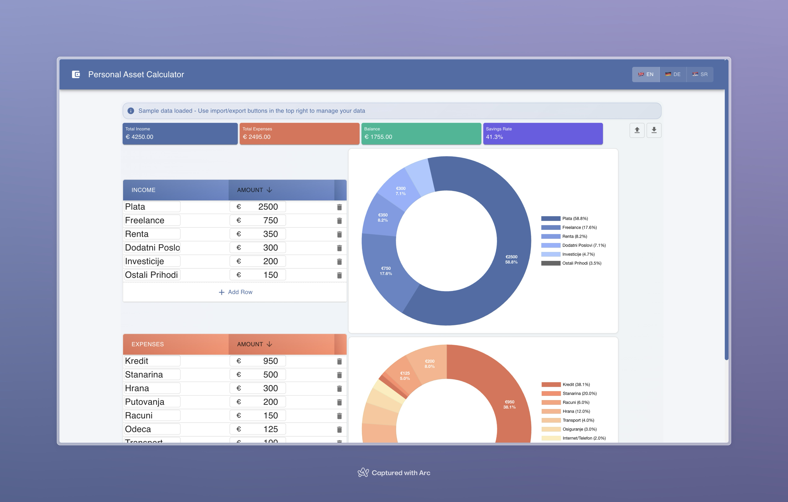

# Personal Asset Calculator

A simple application to manage and analyze personal assets, built with [Create React App](https://github.com/facebook/create-react-app). with goal to learn React :rocket:

# Overview

## Quick Start

- **Run the app**: `npm start` - Launches the app in development mode at [http://localhost:3000](http://localhost:3000).
- **Run tests**: `npm test` - Starts the test runner in interactive mode.
- **Build for production**: `npm run build` - Compiles the app into the `build` folder for deployment.
- **Eject configuration**: `npm run eject` - Exposes configuration files for customization (one-way operation).

-- **Deploy gh-pages**: `npm run deploy` - Deploy the app to gh-pages.
